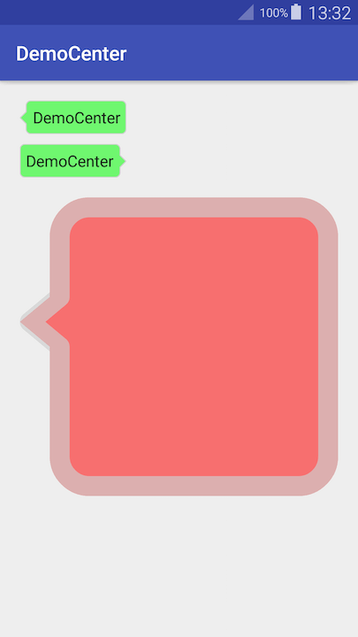

# DemoCenter

__DemoCenter__ 工程包含所有过去、现在或将来的Android示例代码。所有编写的代码以 __排版工整__、__实现规范__、__注释详细__、__可正确运行__ 为基本目标，并在已提交代码的基础上不断进行优化。

## 1、BubbleShape

包含3个气泡：前两个绿色气泡为建议大小，其中第二个绿色气泡支持点击效果；粉红色大气泡为放大展示样式。

    

## 2、AIDl in/out/inout

研究在AIDL中，为所传输对象使用添加修饰符 in/out/inout 后，产生作用和影响的示例。客户端和服务端的执行过程均输出到log，请从log查看结果。

## 3、RecyclerView占位拖动

    

